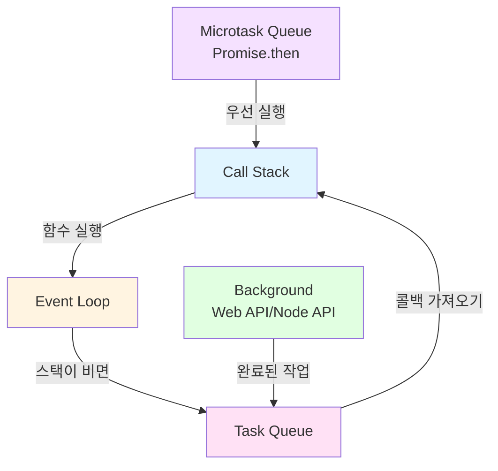

# 호출 스택(Call Stack) & 이벤트 루프(Event Loop)

> 📚 **사전 지식**: 이 문서는 JavaScript의 기본 문법(함수, 변수, 비동기 함수)을 이해한 개발자를 대상으로 합니다.  
> `setTimeout`, `Promise`, `async/await`의 기본 사용법을 알고 있다면 충분합니다.

---

## 1. 자바스크립트의 실행 구조 개요

자바스크립트는 **싱글 스레드(single-thread)** 언어다.  
즉, 한 번에 **한 줄씩만 코드가 실행**될 수 있다.  
그렇다면 여러 함수가 서로 호출될 때, 이 “순서”를 관리하는 구조가 필요하겠지?  
그게 바로 **호출 스택(Call Stack)** 이다.

하지만 세상 모든 코드가 순차적으로만 실행되지는 않아.  
예를 들어, 네트워크 요청이나 타이머는 오래 걸리니까 동시에 처리되어야 하겠지.  
이런 “동시성(Concurrency)”을 담당하는 구조가 **이벤트 루프(Event Loop)** 야.

---

## 2. 호출 스택(Call Stack)

### 개념

> **함수가 호출될 때마다 스택(Stack) 구조로 쌓이고, 실행이 끝나면 위에서부터 제거되는 구조.**

스택(Stack)은 “후입선출(LIFO)” 구조다.  
즉, **나중에 들어온 함수가 먼저 실행을 마치고 나간다.**

---

### 예제 코드

```js
function first() {
  second();
  console.log('첫 번째');
}

function second() {
  third();
  console.log('두 번째');
}

function third() {
  console.log('세 번째');
}

first();
```

**예상 출력 결과:**
```
세 번째
두 번째
첫 번째
```

### 실행 순서 (머릿속에서 이렇게 그려야 한다)

|단계|호출 스택 상태|출력|
|---|---|---|
|1|(main) → `first()` 호출||
|2|(main) → `first()` → `second()`||
|3|(main) → `first()` → `second()` → `third()`||
|4|`third()` 실행 → 콘솔 `세 번째` → 스택에서 제거|`세 번째`|
|5|`second()` 실행 → 콘솔 `두 번째` → 스택에서 제거|`두 번째`|
|6|`first()` 실행 → 콘솔 `첫 번째` → 스택에서 제거|`첫 번째`|
|7|스택이 모두 비면 프로그램 종료||

🟢 **출력 결과:**

```
세 번째
두 번째
첫 번째
```

---

### 핵심 비유

> “프링글스 통 안에 감자칩을 넣고 위에서부터 꺼내 먹는다.”

- 함수가 호출될 때마다 위에 쌓임.
    
- 실행이 끝나면 위에서부터 하나씩 제거됨.
    

---

### 동기(Synchronous) 실행

- 위 코드처럼 순차적으로 실행되는 경우.
    
- **스택이 빌 때까지 다음 작업은 대기.**
    
- 자바스크립트는 본질적으로 이 “동기 실행 모델”을 따른다.
    

---

### 예시 2: 동기 코드에서의 순서

```js
console.log('시작');
setTimeout(() => console.log('3초 후 실행'), 3000);
console.log('끝');
```

> 많은 초보자들이 이걸 보면 “3초 뒤에 ‘3초 후 실행’이 찍히겠지?” 까지는 아는데,  
> 그게 **언제, 어떻게 스택 안에서 빠지는지**를 잘 모른다.  
> 바로 이때 등장하는 게 **이벤트 루프(Event Loop)** 야.

---

## 3. 이벤트 루프(Event Loop)

이제 `setTimeout`, `Promise`, `async/await` 같은 비동기 코드가 어떻게 실행되는지 보자.

---

### 구조 요약

자바스크립트 엔진에는 다음 세 개의 주요 공간이 있다.

|구역|역할|
|---|---|
|**호출 스택(Call Stack)**|실제 코드 실행 공간|
|**백그라운드(Background)**|Web API or Node API (비동기 작업이 처리됨)|
|**태스크 큐(Task Queue)**|완료된 비동기 작업의 콜백이 대기하는 공간|

그리고 이 세 개를 **이벤트 루프(Event Loop)** 가 계속 돌면서 관리한다.  
즉, “스택이 비었을 때 큐에 있는 콜백을 하나 가져와 실행”하는 관리자다.

---

### 비동기 코드 동작 순서

다음 코드를 예로 들어보자 👇

```js
function run() {
  console.log('시작');
  setTimeout(() => console.log('3초 후 실행'), 3000);
  console.log('끝');
}

run();
```

**예상 출력 결과:**
```
시작
끝
(3초 후)
3초 후 실행
```

#### 🧩 실행 단계별 분석

|단계|동작|설명|
|---|---|---|
|1|`run()` 호출 → 스택에 push||
|2|`console.log('시작')` 실행 → 즉시 출력|`시작`|
|3|`setTimeout()` 실행 → Web API(백그라운드)로 타이머 전달|타이머 3초 설정|
|4|`console.log('끝')` 실행 → 즉시 출력|`끝`|
|5|3초가 지나면, 백그라운드가 콜백(`() => console.log('3초 후 실행')`)을 **태스크 큐**로 보냄||
|6|이벤트 루프가 호출 스택이 비었는지 확인 → 비었으면 큐의 콜백을 실행||
|7|콘솔 출력|`3초 후 실행`|

🟢 **결과 출력 순서:**

```
시작
끝
3초 후 실행
```

---

### ⚙️ 이벤트 루프의 역할 요약

```
while(true) {
  if (callStack.isEmpty() && taskQueue.hasTasks()) {
    callStack.push(taskQueue.dequeue());
  }
}
```

즉, 스택이 빌 때마다 큐에서 하나씩 끌어와 실행한다.

---

## 4. 백그라운드에서 동시에 처리되는 비동기 함수들

Node.js나 브라우저에서는 비동기로 다음과 같은 함수들을 백그라운드로 보낸다.

|범주|예시|
|---|---|
|**타이머 관련**|`setTimeout`, `setInterval`|
|**I/O**|파일 읽기/쓰기, DB 쿼리, 네트워크 요청|
|**암호화**|`crypto.pbkdf2`, `crypto.scrypt`|
|**압축**|`zlib`|
|**Worker Threads**|CPU 병렬 작업|

---

## 5. 고급 이벤트 루프: Promise & Microtask Queue

> 🔥 **중급 주제**: 이 섹션은 기본 이벤트 루프 개념을 이해한 후 학습하는 것을 권장합니다.  
> Promise와 async/await의 기본 사용법을 알고 있다면 충분합니다.

`Promise`와 `process.nextTick()`은 **일반 태스크 큐보다 우선순위가 높다.**

### 예제

```js
console.log('시작');

setTimeout(() => console.log('타이머'), 0);
Promise.resolve().then(() => console.log('프로미스'));

console.log('끝');
```

**예상 출력 결과:**
```
시작
끝
프로미스
타이머
```

🧩 실행 순서:

1. `시작` 출력
    
2. `끝` 출력
    
3. **프로미스 콜백(마이크로태스크)** 실행 → `프로미스`
    
4. **타이머(태스크 큐)** 실행 → `타이머`
    

🟢 **실제 결과**

```
시작
끝
프로미스
타이머
```

✅ **이유**

- 이벤트 루프는 일반 태스크 큐보다 **마이크로태스크 큐**를 먼저 비운다.
    
- 따라서 `Promise.then()` → `setTimeout()` 순으로 실행된다.
    

---

## 6. Node.js와의 연계

> 🔥 **고급 주제**: 이 섹션은 Node.js 내부 동작을 이해하고 싶은 개발자를 위한 선택적 내용입니다.  
> 실무에서는 이 개념을 몰라도 코드 작성에 문제가 없지만, 성능 최적화나 디버깅 시 유용합니다.

Node.js도 완전히 동일한 구조를 가진다.  
V8 엔진 위에서 동작하며, **libuv**라는 C++ 기반 이벤트 루프 구현체를 사용한다.

|구성요소|Node.js에서의 실제 구현|
|---|---|
|호출 스택|V8 JavaScript Engine|
|백그라운드|libuv Thread Pool (파일 I/O, 암호화, DNS 등)|
|태스크 큐|Callback Queue|
|이벤트 루프|libuv Event Loop Core|

즉, 브라우저에서는 Web API가 백그라운드를 맡고,  
Node.js에서는 **libuv가 백그라운드 역할**을 맡는다.

---

## 7. 핵심 개념 시각화

### ASCII 다이어그램

```
┌──────────────────────────────┐
│         Call Stack           │
│ ──────────────────────────── │
│  console.log('끝')          │
│  run()                      │
│  main()                     │
└──────────────▲──────────────┘
               │
               ▼
┌──────────────────────────────┐
│          Event Loop          │
│  - 스택이 비면 큐에서 하나 이동 │
└──────────────────────────────┘
               │
               ▼
┌──────────────────────────────┐
│         Task Queue           │
│  setTimeout callback()       │
│  Promise.then()              │
└──────────────────────────────┘

┌──────────────────────────────┐
│         Background           │
│  타이머, I/O, 네트워크 요청  │
└──────────────────────────────┘
```

### Mermaid 다이어그램 (Obsidian에서 렌더링됨)



---

## 8. 핵심 요약 정리

|구분|설명|예시|
|---|---|---|
|**호출 스택**|함수 호출이 쌓이고 실행되는 공간|`console.log`, `함수()`|
|**백그라운드**|시간이 걸리는 작업이 병렬로 실행되는 곳|`setTimeout`, 파일 I/O|
|**태스크 큐**|완료된 비동기 콜백들이 대기|콜백 함수|
|**이벤트 루프**|스택이 비면 큐에서 콜백을 실행|“감독관 역할”|
|**마이크로태스크 큐**|Promise, process.nextTick 등 우선 실행|`Promise.then()`|

---

## 9. 반드시 이해해야 할 Checkpoint

✅ 다음 질문에 전부 “설명 가능해야” Node.js 실무로 넘어갈 수 있다.

1. 호출 스택이란 무엇이며, 어떤 구조로 함수가 실행되고 종료되는가?
    
2. `setTimeout`의 콜백은 어디서 대기하다가 언제 실행되는가?
    
3. 이벤트 루프의 핵심 역할은 무엇인가?
    
4. Promise.then()과 setTimeout(…, 0)의 실행 순서는 왜 다른가?
    
5. Node.js에서 이 구조가 libuv를 통해 어떻게 구현되는가?
    

---

## 🔍 학습 팁

- **직접 그려라:**  
    종이에 "호출 스택 ↔ 백그라운드 ↔ 태스크 큐" 3단 구조를 그리고,  
    각 단계마다 함수가 이동하는 과정을 손으로 시뮬레이션.
    
- **실행 실험:**  
    브라우저 콘솔 or Node REPL에서 `Promise`, `setTimeout`, `async/await` 섞은 코드를 직접 돌려보며 예상 순서와 결과 비교.

---

## 📚 참고 자료

- [MDN: 이벤트 루프](https://developer.mozilla.org/ko/docs/Web/JavaScript/EventLoop)
- [Node.js: 이벤트 루프](https://nodejs.org/ko/docs/guides/event-loop-timers-and-nexttick/)
- [Philip Roberts: What the heck is the event loop?](https://www.youtube.com/watch?v=8aGhZQkoFbQ) (영상 강의)

---

## 다음 단계

이 개념을 이해했다면 다음 주제로 넘어가세요:
- **02. var, const, let** - 변수 선언과 스코프
- **04. Promise & async/await** - 비동기 처리의 실제 구현
