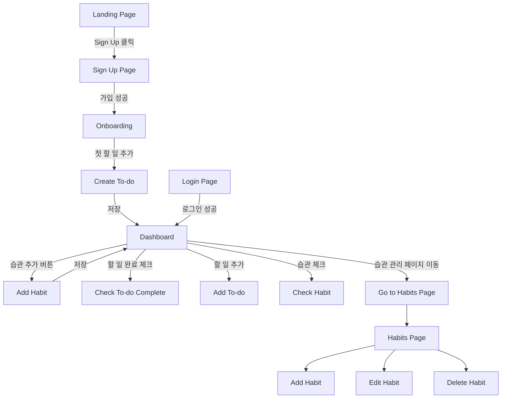
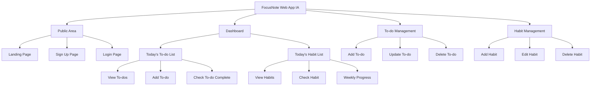

# **PM 기획 문서 템플릿**

이 템플릿은 하나의 서비스 시나리오 기준으로 아래 세 가지는 독립 관리하면서 상호 연결되도록 설계함.

1. User Flow
    
2. Information Architecture
    
3. Requirements Documentation

### 세 문서의 차이를 한눈에 비교

| 구분    | User Flow         | Information Architecture | Requirements Documentation |
| ----- | ----------------- | ------------------------ | -------------------------- |
| 관점    | 사용자 경험 중심         | 기능·페이지 구조 중심             | 기능의 동작 규칙 중심               |
| 형태    | 흐름도(Flowchart)    | 트리 구조(Tree)              | 텍스트 기반 명세                  |
| 질문    | “사용자는 어떻게 이동하는가?” | “이 기능은 어디에 속하는가?”        | “이 기능은 무엇을 해야 하는가?”        |
| 중점    | 시간적 순서            | 공간적 구조                   | 기능 단위 정의                   |
| 도움 대상 | UX/UI / QA / 개발   | PO/Dev/Design            | Dev / QA / PM              |
| 산출물   | Flowchart         | Sitemap/Feature Map      | Requirement Sheet + AC     |


---

# **01. User Flow Diagram**

> [!summary] 목적  
> 사용자가 앱/웹 안에서 **어떤 행동을 어떤 순서로 수행하는지**를 시간 흐름에 따라 시각적으로 정리한 다이어그램.  
> “사용자는 어디에서 시작해 어디로 이동하며 무엇을 하는가?”를 설명한다.
### 정의

User Flow는 서비스 이용 과정에서 사용자 행동을 **선형 또는 분기 흐름**으로 시각화하여, UX 설계·개발·테스트가 동일한 사용자 경험을 기준으로 작업할 수 있게 한다.

### 역할

- UX/UI 디자이너: 와이어프레임 제작 기준, 디자인의 근간
    
- 화면 이동 및 조건 분기 확인
    
- 개발팀: 필요한 화면/기능/API 필요여부를 정확히 파악
    
- QA가 전체 시나리오 테스트 케이스를 설계할 때 기준 제공

### User Flow Diagram 예시 (draw.io)


#### 포함되는 요소

- 화면 간 이동
    
- 버튼 클릭 → 다음 페이지
    
- 입력 → 에러 → 재시도 플로우
    
- 성공/실패 분기 처리
    
- 온보딩 → 핵심 기능 → 완료 흐름


## ! ==User Flow Diagram에 **반드시 추가로 필요한 문서/설명**==

- User Flow Diagram은 “사용자 이동 경로”만 보여주기 때문에, **행동의 의도·조건·결과**를 설명하는 보조 문서가 반드시 필요하다.

- 아래 세 가지가 필수 구성요소다.
## **1. Flow Narrative (플로우 내러티브)**

**각 단계에서 사용자가 무엇을 하고, 왜 그 행동을 하는지** 글로 풀어 설명하는 문서.

예시:

```
Step 1: 사용자는 Landing Page에서 서비스 정보를 확인하고 "Sign Up" 버튼을 누른다.
Step 2: Sign Up 화면에서 이메일/비밀번호를 입력하고 계정을 생성한다.
Step 3: Onboarding 화면에서 첫 번째 To-do 생성을 유도한다.
Step 4: 사용자는 To-do를 생성 후 Dashboard로 이동하여 오늘 해야 할 일을 확인한다.
```

→ User Flow Diagram은 “구조”이고,  
→ Flow Narrative는 “==스토리==”다.

둘이 함께 있어야 UX 의도가 전달된다.

## **2. Entry/Exit Conditions (조건 정의)**

각 주요 단계(화면)의 아래 두 조건을 적는다.

- **시작 조건(Entry Conditions)**
    
- **종료 조건(Exit Conditions)** 

예시:

```
[Sign Up Page]
Entry: 사용자가 Sign Up 버튼을 클릭한 경우
Exit: 계정 생성 성공 또는 실패 메시지 확인 후 이동
```

→ 개발팀이 “언제 이 화면이 호출되는가?”를 명확히 알 수 있음.

## **3. Error / Alternative Flow (예외 플로우)**

메인 플로우만으로는 실제 개발이 불가능하므로, 반드시 다음을 추가해야 한다:

- 입력 오류(Validation Error)
    
- 로그인 실패
    
- 네트워크 오류
    
- 필수 값 미입력
    
- 권한 부족 상황

예시:

```
Alternative Flow A1: 비밀번호 형식 오류 → Sign Up 실패 → 오류 메시지 표시
Alternative Flow A2: 네트워크 실패 → 재시도 옵션 제공
```

→ ==UX/Dev/QA 모두에게 매우 중요한 문서  ==


---
# **02. Information Architecture (IA)**

> [!summary] 목적  
> 서비스의 전체 기능을 **계층적 구조(Tree)** 로 묶어 전반적인 기능 범위(Scope)를 정의한다. 즉, 서비스의 기능이 어떤 상·하위 관계로 구성되는지를 나열한 **정적 구조도**. 
> 
> “이 기능은 어디에 속하며 어떻게 조직되어 있는가?”를 보여준다.

### 정의

Information Architecture는 서비스의 구조적 구성요소를 **정적 구조**로 표현한 문서이다. 

> ===User Flow가 “시간적 흐름”이라면, IA는 **공간적 구조**를 설계한다.===

### 역할

- 전체 기능 스코프 정의
    
- 기능 누락/중복 방지
    
- 백엔드 도메인 구조 설계의 참고 기준
    
- 메뉴·페이지 구조 설계의 기준
    
- Requirements 문서 작성의 기반
	
-  프로덕트 전체 구조를 정리하여
	 
	- PO/PM: 스코프 관리 기준
	    
	- 개발자: 기능 단위 분리 / 모듈 설계 기준
	    
	- 디자이너: IA 기반으로 정보 구성 설계 


## IA 다이어그램 예시 (draw.io)




#### 포함되는 요소

- 주요 메뉴 (예: Dashboard / My Page / Settings)
    
- 각 메뉴 안의 하위 기능
    
- 기능 세트(Feature Set) 구조
    
- 페이지 간 상·하위 관계

# ! ==Information Architecture(IA)에 **필수로 추가해야 하는 문서/설명**==

IA는 전체 기능 구조(Static Structure)를 보여줄 뿐이므로, 다음 3가지 보조 문서가 필요하다.

---

## **① Feature Definition Document (기능 정의 문서)**

IA의 각 노드(예: Add To-do, Edit Habit 등)가 실제로 **무엇을 하는 기능인지** 설명해야 한다.

예시:
```
Feature: Add To-do
Description: 사용자가 제목, 메모, 날짜를 입력해 새로운 할 일을 생성하는 기능
Required Fields: 제목(필수), 메모(선택), 날짜(기본 오늘)
```

→ IA는 “기능 리스트”이고,  
→ Feature Definition은 “기능의 설명서”.
## **② Page Inventory (페이지 목록 + 역할)**

IA에 등장하는 모든 페이지의 역할을 문서로 작성해야 한다.

예시:

```
Page: Dashboard
Purpose: 오늘의 할 일 및 습관 진행도를 한눈에 보여주는 요약 페이지
Primary Actions: 할 일 확인/추가, 습관 체크
Secondary Actions: 상세 페이지 이동
```

이 문서가 없으면 디자이너·개발자가 동일한 이해를 할 수 없다.
## **③ Navigation Rules (탐색 규칙)**

“어떤 화면에서 어떤 화면으로 이동할 수 있는지”를 규칙화한다.

예시:

```
Dashboard → Habits Page: "습관 관리" 버튼 클릭 시 이동
To-do List → Dashboard: 상단 Back 버튼 또는 로고 클릭
```

→ IA는 구조를 보여주지만,  
→ Navigation Rules는 **구조의 연결 방식을 설명**한다.


---

# **03. Requirements Documentation**

> [!summary] 목적  
> 서비스의 각 기능이 **무엇을 해야 하는지(What)** 를 정확하고 모호함 없이 명확하게 글로 정의하여  
> 개발·QA·디자인 모두가 하나의 기준을 공유하도록 한다.
> 
> 화면 흐름(User Flow)과 기능 구조(IA)를 바탕으로 “각 기능의 동작 규칙”을 명문화한 문서라고 보면 된다.
### 정의

Requirements 문서는 User Flow와 IA를 기반으로 각 기능의 **입력 조건, 출력, 상태 변경, 예외 처리**를 구체적으로 설명한 문서다.

### 역할

- 디자이너: UX 요소의 필수 요건 파악
	
- PM: 스코프 관리 및 커뮤니케이션 기준
    → 기능 개발의 **싱글 소스 오브 트루스(Single Source of Truth)** 역할
	 
- 개발자: 구현할 기능의 정확한 범위 파악
    
- QA: 테스트 케이스 작성의 기준

### 포함되는 요소

1. 기능 설명
    
2. 입력 값 & Validation 규칙
    
3. 상태 변화
    
4. 서버와의 주고받는 데이터 조건
    
5. 예외 상황 처리
    
6. 화면에서 보여야 하는 요소들

# ! =="Requirements Documentation"을 **구체적으로 어떻게 작성해야 하는지**==

## Requirements 문서 작성의 핵심 규칙

1. **How가 아니라 What을 쓴다.**  
    (구현 방법이 아니라 “무엇을 해야 하는가”만)
    
2. **명확하고 측정 가능하게 쓴다.**  
    “빠르게” X → “1초 이내” O
    
3. **모든 규칙은 AC로 검증 가능해야 한다.**
    
4. **IA의 기능 단위 + User Flow의 행동 단위를 합쳐 작성한다.**


Requirements Documentation은 **“각 기능이 무엇을 해야 하는지(What)”를 명확하게 기술하는 문서**다.
아래 템플릿이 가장 정석적인 형태이다

---

# **Requirements Documentation 템플릿**

## ## 1) 기능 개요 (Feature Overview)

```
Feature Name: Add To-do
Feature Area: To-do Management
Description: 사용자가 새로운 할 일(Task)을 생성할 수 있는 기능
Related Pages: Dashboard, To-do List
Related Flow: User Flow Diagram Step 3~4
```

## ## 2) 기능 목적 (Purpose)

```
사용자가 오늘 혹은 미래 일정에 맞춰 Task를 생성해 일정 관리가 가능하게 한다.
```

## ## 3) 기능 상세 요구사항 (Functional Requirements)

### R-1. 입력 값 규칙

```
- 제목(title)은 필수 입력이다.
- 메모(note)는 옵션이다.
- 날짜(dueDate)는 기본값이 오늘이며, 사용자가 변경할 수 있다.
```

### R-2. 동작 규칙

```
- 제목이 비어 있으면 저장되지 않아야 한다.
- 저장 성공 시 대시보드의 할 일 목록 상단에 추가되어야 한다.
- 저장 실패 시 오류 메시지를 표시해야 한다.
```

### R-3. 상태 변경 규칙

```
- 새로운 To-do는 기본 상태가 '미완료(Pending)'여야 한다.
- 생성 시 타임스탬프(createdAt)가 자동 저장된다.
```

## ## 4) UX 요소 요구사항 (UI/UX Requirements)

```
- 제목 입력란은 가장 상단에 위치한다.
- 저장 버튼은 우측 상단 또는 하단에 고정 배치한다.
- 오류 발생 시 빨간색 Alert을 표시한다.
```

## ## 5) 에러/예외 처리 (Error Handling)

```
- 제목이 없는 경우 → "제목을 입력해주세요."
- 서버 저장 실패 → "저장에 실패했습니다. 다시 시도해주세요."
```

## ## 6) Acceptance Criteria (AC)

```
AC-1:
Given 사용자가 제목을 입력하고
When "추가" 버튼을 누르면
Then 새로운 To-do가 대시보드에 즉시 나타나야 한다.

AC-2:
Given 제목이 비어 있는 경우
When "추가" 버튼을 누르면
Then 오류 메시지가 표시되어야 하며 저장되지 않아야 한다.
```

## ## 7) Non-Functional Requirements (선택)

```
- 저장은 1초 이내에 처리되어야 한다.
- 모바일 화면에서도 사용 가능해야 한다.
```